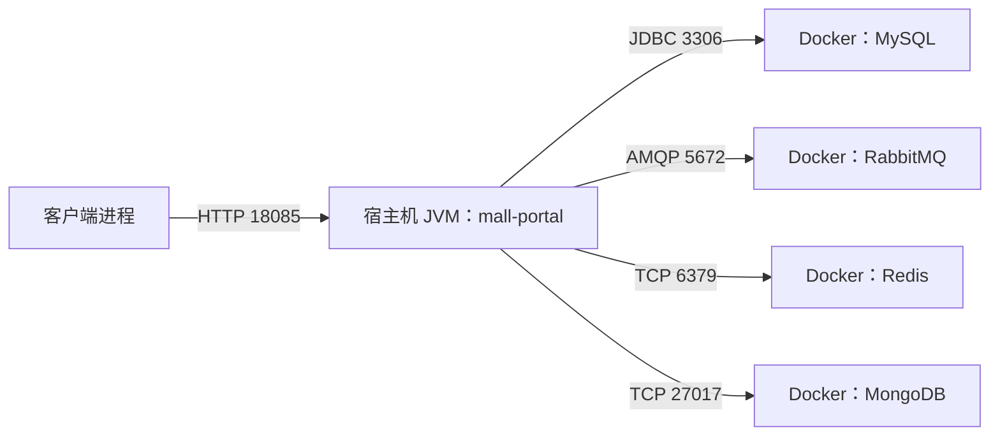

# E2 说明

当前评分以[本实验细则](../课程考核方案.md#rubric-e2)为准；个人题目执行[Cursor计划](../Cursor候选靶点产出计划.md)对应编号。

当前学生目标：按[候选库](../教师候选靶点库.md)识别分层中的具体设计原则问题，给出文件:行号、调用链、局部改动及测试／前后对照。下文是教师历史示例；其中“不要求实施解耦”的旧记录不代表当前学生完成要求。

## 当前 Java 迁移与验证（2026-10-03）

实现入口为 `com.macro.mall.sdc.e2.LayerRules`，在 IDEA 可直接运行 main；操作步骤见《操作说明.md》。原 Python 实现和测试已由 Java 替代，不需要 Python 环境。

本次命令：`rtk proxy mvn -o -f mall/pom.xml -pl SDC/E1,SDC/E2,SDC/E5 -am test`，JDK 17：E1/E2/E5 各 3 项受控文件测试通过，总计 9 项。测试验证解析、正反例和定位，不断言当前仓库固定行号。三个 main 已分别对真实 mall 执行：E1 输出八条直接依赖与取消消息锚点；E2 输出三类问题、admin/portal 无直接依赖；E5 输出四处库存影响与两个候选钩子，`getLowStock` 存在、扣库存 SQL 不引用 `low_stock`。

本轮未重跑中间件集成验证。下文原运行数量、文件行号与 evidence 属于历史记录；图及历史日志保持原样。源码启发式结果需人工复核，不证明交易执行成功，也不替代 E3/E4/E6 的真实业务 JUnit。

## ① 修改前的缺陷，以及改了哪里

这次没有改 mall 的业务代码。三处缺陷还在原文件里。课程侧新增的是检查程序 `SDC/E2/src/main/java/com/macro/mall/sdc/e2/LayerRules.java`，用来在不启动 mall 的情况下把它们报出来。

1. 接口名与行为不一致。`OmsPortalOrderController.java:64-69` 的 `/order/cancelOrder` 只调用 `portalOrderService.sendDelayMessageCancelOrder(orderId)`，不调用 `cancelOrder`。调用方是 HTTP 客户端；成功只表示延迟消息已发出。真正改订单状态的调用者是 `CancelOrderReceiver.java:22-23`，数据从 TTL 队列到期后进入 `mall.order.cancel`。用户马上取消走的是同一控制器 `:92-96` 的 `/cancelUserOrder`。
2. 业务判断写在控制器。`UmsAdminController.updatePassword` 在 `:148` 拿到服务返回的整数，`:151-156` 把 `-1`、`-2`、`-3` 译成“提交参数不合法”“找不到该用户”“旧密码错误”。这些含义是服务 `UmsAdminServiceImpl.java:246-261` 定的：参数不合法、用户不存在、旧密码错误，成功返回 `1`。
3. 服务依赖生成查询对象。`OmsPortalOrderServiceImpl.list` 在 `:367-375` 构造 `OmsOrderExample`，设 `deleteStatus`、`memberId` 和可选的 `status`，再 `selectByExample`。同一类对象还出现在 `:307` 和 `:440`。类本身是生成代码 `OmsOrderExample.java:8`。

## ② 原则和取舍

历史示例提出以下两个设计疑点；是否构成原则违反还须结合具体边界和变化场景，不能凭依赖生成类直接定罪：

- 逻辑泄漏。取消接口的名字不是它的行为；改密的失败原因写在控制器，控制器必须知道 `-1/-2/-3` 的业务含义。
- 依赖生成代码。订单服务直接使用 MyBatis Generator 的查询 DSL。生成器一改条件写法，服务就要跟着改。查询口径没有收在手写的数据访问接口后面。

`mall-admin` 和 `mall-portal` 的 pom 互不依赖。控制器通过本模块服务访问数据，这本身不是分层违规。

两种实际解耦方案（静态检查只是检查手段，不算解耦方案）：

| | 可测试性 | 可替换性 | 改动成本 |
| --- | --- | --- | --- |
| 方案 A：明确服务结果类型与订单查询接口 | 改密返回 PasswordChangeResult，由服务决定业务原因；订单服务依赖 OrderQuery 接口，测试替换查询实现 | 生成 Example 留在手写适配器内，服务不依赖生成器 DSL | 中高：改服务签名、控制器映射和查询调用；保留旧 HTTP 地址为兼容入口，新增准确命名的延迟取消入口 |
| 方案 B：保持服务签名，抽出应用门面与手写 DAO | PasswordChangeFacade 将旧整数转换成具名结果；OrderQueryDao 封装当前 Example 查询，门面可单测 | 对外调用约定不变，但内部整数协议仍需保留，替换生成器只影响 DAO | 较低：新增局部门面及 DAO 并迁移控制器/查询调用，旧取消入口委托明确命名的调度操作；不改变“延迟取消”语义 |

决策：倾向 B 作为后续兼容改造的第一步，接受内部整数协议暂留的成本；否决一次性改所有签名的 A，因为本轮目标是架构评价，尚无跨客户端迁移计划。旧轮次只做方案评价，本次两案均未实施；当前 E2 已要求局部改动或可运行对照，因此这份旧产出未达当前要求；现有静态检查只记录三处问题，不应称为“落地了方案 B”。交易接口语义不变，之后迁移再由行为测试验证。

4+1：逻辑视图是 `mall-logical.html`；进程视图是 `mall-cancel.html`，其中到期消息由独立的 `CancelOrderReceiver` 消费后调用服务，队列本身不执行 Java；开发视图是 E1 的 `mall-dependencies.html`。E1 的 `mall-runtime.html` 是运行关系图，不能单独当作部署物理视图，下面补足部署节点。



这里描述本次开发部署，不冒充生产拓扑。`mall-mbg` 是加载进 JVM 的 jar，不是单独机器或运行进程。

“+1”场景：用户下单 → portal 同一请求内调用订单服务/Mapper 写入 MySQL、发送 TTL 消息 → HTTP 返回；若支付，服务更新订单并扣减库存；若到期未支付，RabbitMQ 投递取消队列 → Receiver 调用订单服务检查状态并释放锁库存。该场景连接逻辑职责、线程/异步边界、七模块依赖及上述部署节点。当前只读实验服务关闭消息消费者，完整异步链的代码证据不等于本次已执行取消。

## ③ 历史验证（迁移前 Python 运行，不是本次 Java 结果）

命令：

```bash
python3 -m unittest experiments/E2/tests/test_e2_layer_rules.py -v
```

结果：2 项通过。

- `test_three_known_violations` 固定了控制器 `:67` 的取消名不副实、`UmsAdminController.java:151` 的返回码翻译、以及 `OmsPortalOrderServiceImpl.java:367` 的 `OmsOrderExample`。
- `test_admin_and_portal_do_not_depend_on_each_other` 固定了 admin 与 portal 互不依赖。

这些测试证明检查程序和当前源码一致。它们不证明取消或改密在数据库里的行为变好了，因为 mall 的业务代码没有改，也没有启动 MySQL 和 RabbitMQ。
