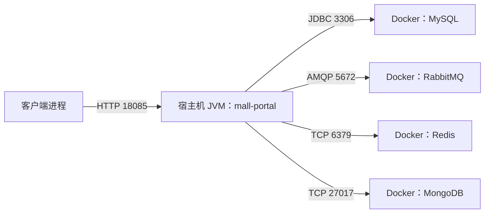

# E2：设计原则问题与局部改进

示例按《示例分支工作流程指南》组织：每个示例是从本分支分出的独立分支 `exp/e2-<NN>`，彼此没有先后次序，也不合并；`NN=00` 为教师演示示例。靶点、验收准则和对照结果见对应 Issue（标签 `E2`）。

复现：`git checkout exp/e2-<NN> && SDC/compare.sh E2-<NN>`（JDK 17；数据库用例需要 `SDC/environment/compose.yml`）。

## 公共 4+1 视图

各示例引用本节，并在 Issue 里标注本题与公共视图的差异。本节取自 `sdc-java-migration:SDC/E2/说明.md` 第 41–54 行，图文件在 `diagrams/`（`mall-dependencies.html`、`mall-runtime.html` 是 E1 产出）。

4+1：逻辑视图是 [`mall-logical.html`](diagrams/mall-logical.html)；进程视图是 [`mall-cancel.html`](diagrams/mall-cancel.html)，其中到期消息由独立的 `CancelOrderReceiver` 消费后调用服务，队列本身不执行 Java；开发视图是 E1 的 [`mall-dependencies.html`](diagrams/mall-dependencies.html)。E1 的 [`mall-runtime.html`](diagrams/mall-runtime.html) 是运行关系图，不能单独当作部署物理视图，下面补足部署节点。

这里描述本次开发部署，不冒充生产拓扑。`mall-mbg` 是加载进 JVM 的 jar，不是单独机器或运行进程。

“+1”场景：用户下单 → portal 同一请求内调用订单服务/Mapper 写入 MySQL、发送 TTL 消息 → HTTP 返回；若支付，服务更新订单并扣减库存；若到期未支付，RabbitMQ 投递取消队列 → Receiver 调用订单服务检查状态并释放锁库存。该场景连接逻辑职责、线程/异步边界、七模块依赖及上述部署节点。当前只读实验服务关闭消息消费者，完整异步链的代码证据不等于本次已执行取消。
