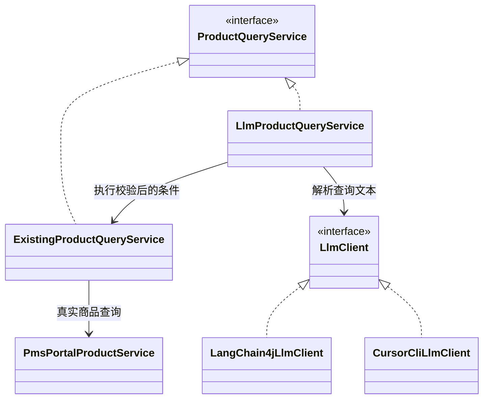

# E7：Java 只读商品查询与 LLM

当前评分以[本实验细则](../课程考核方案.md#rubric-e7)为准；个人题目执行[Cursor计划](../Cursor候选靶点产出计划.md)对应编号。

当前学生选题见[合并后的业务设计](../教师候选靶点库.md#e7-business)。下文保留教师商品查询实现与历史验证供参考；其测试数和模型成绩不代表学生所选业务已验收。

产品代码位于 `mall-portal/src/main/java/com/macro/mall/portal/query` 和 `llm`；实验入口与测试位于本模块标准 Java 目录。没有库存草稿、确认、撤销或写接口。

## 业务结构

- `ProductQueryService` 有普通查询 `ExistingProductQueryService` 和自然语言查询 `LlmProductQueryService` 两种实现。
- 结构化请求直接执行。普通实现把文本作为名称关键词；LLM 实现只将文本转成受限条件，再调用普通实现。
- `ProductQueryCriteria` 仅允许名称包含、价格严格低于、库存严格少于及 AND 组合。至少一个条件；名称 1–200 字，百分号、下划线和反斜杠按字面转义（使用项目 MySQL 的默认 LIKE 转义模式），价格 0–99999999.99 且最多两位小数，库存 0–2147483647；分页为 1–100000 页，每页 1–100 条。
- 两种实现共用原 `PmsPortalProductServiceImpl.search` 的数据访问；名称、价格、库存条件均进入同一个 MyBatis Example，在数据库分页前过滤。原六参数调用保留品牌、分类、排序语义，新结构化查询按 ID 降序分页，仍只返回未删除、已上架商品。
- 返回商品 ID、名称、价格、库存摘要，均来自数据库。模型不返回商品、不输出 SQL、没有工具、数据库权限或写路径。
- 模型不支持的操作或非法 JSON 返回 `UNSUPPORTED`；认证失败、超时、未配置等返回 `UNAVAILABLE`；均不偷偷转成普通搜索。数据库失败继续按原 portal 异常路径处理。
- 业务类仅依赖 `LlmClient`。访问层 `LangChain4jLlmClient` 使用普通 Java `langchain4j-open-ai:1.21.0` 的 `ChatModel`，不认识商品语义；已在 Java 17 编译并通过本地 HTTP 协议测试。

## 配置与边界

`LLM_PROVIDER`（Spring 属性 `mall.llm.provider`）默认 `openai-compatible`，使用下述 LangChain4j API 配置。设为 `cursor` 时切换到 `CursorCliLlmClient`，仍实现同一个 `LlmClient`，查询业务类不变。

Cursor 路径使用本机已安装并登录的 `cursor-agent`（及本仓库要求的 `rtk`），直接由官方 CLI 使用其保存的登录状态，不提取、不打印、不转换 Cursor token。模型由 `LLM_MODEL` 指定，缺省 `grok-4.7-high-fast`。此路径不使用 base URL、API key 或 API access-token，也不把 Cursor 登录 token 当作 OpenAI-compatible API key。执行时移除继承的 `CURSOR_API_KEY` 覆盖，优先使用本次用户要求的本机登录。

每次调用使用独立空临时工作区，写入官方 `.cursor/cli.json`，显式拒绝 Shell、相对/绝对 Read/Write、WebFetch 和 MCP 工具；以 ask 模式输出 JSON，系统要求与用户输入分别 JSON 编码。CLI 仅接收解析指令与查询文本，不传仓库或题集答案。超时 60 秒终止进程及仍在运行的子进程，退出后删除临时工作区；stderr 不进入业务错误或评测报告。离线测试验证命令协议、权限配置、错误信封拒绝、超时进程结束及目录清理。这是 CLI 路径维持既有“模型无工具权限”边界所需控制；官方权限语法若变化须复查测试和文档，移除 CLI 接入时可一并删除。

[Cursor 官方认证](https://cursor.com/docs/cli/reference/authentication)与[权限说明](https://cursor.com/docs/cli/reference/permissions)支持本机登录和项目 deny 优先规则。

`LLM_BASE_URL`、`LLM_MODEL`、`LLM_API_KEY` 或 `LLM_ACCESS_TOKEN`。也可设置 Spring 属性 `mall.llm.base-url/model/api-key/access-token`。两种凭据只能配置一个；未配置模型不影响普通查询。访问令牌必须是目标 API 接受的 Bearer token，不是网页 Cookie 或 IDE 登录态；没有通用自动刷新。默认单次超时 20 秒、无重试，禁用请求和响应日志。

仅兼容相同 OpenAI-compatible 协议的服务可只改配置。厂商专用协议需要在访问层采用相应 SDK 适配器。提示词要求拒绝写操作、隐私请求及范围外任务，代码还会拒绝未知 action/字段、无条件、重复键、尾随 JSON、非整数库存及越界值。语义解析是否完整拒绝所有混合请求需要真实模型评测；离线替身不能证明模型准确率。即使模型误判，执行能力仍只有受限公开商品查询。

## 证据

2026-10-03：JUnit 共 16 项通过（查询 8、SDK 3、评测 2、Cursor CLI 离线进程 3）。覆盖共同结构化语义、AND SQL 条件、旧调用兼容、范围校验、写 action 拒绝、模型失败不降级、API key/token、本地 HTTP 401/超时及评测误判防止。SDK 测试仅绑定 loopback，无在线模型调用。

`evaluation/holdout-1.json`、`holdout-1-result.json` 与 `evidence/historical` 是原 Python/Cursor 版历史证据，保持原文。原 34/34 不适用于本版。`readonly-regression.json` 是公开题的新版回归期望：草稿题改为拒绝，H16 超出新版价格范围也拒绝；旧的商品 ID 期望依赖原样例数据库，当前可见性/数据变化可能导致失败。它不是独立留出集。

已使用授权的本机 Cursor 登录完成真实数据库演示和两套独立题集评测。第一套30/32暴露名称字面字符过度拒绝，修复后两题回归通过。第二套31/32：正常19/20、对抗8/8、分布外4/4；唯一失败是模型在正确 JSON 前夹带说明，被严格解析拒绝。对抗/分布外通过表示应用结果正确，部分模型原文仍偏离协议，不能称为模型自身完全遵守指令。原始结果、方法与限制见[迁移验收](../迁移验收.md)；未将离线测试或已公开回归题计作独立准确率。

参考：[官方 OpenAI 集成](https://docs.langchain4j.dev/integrations/language-models/open-ai/)。
